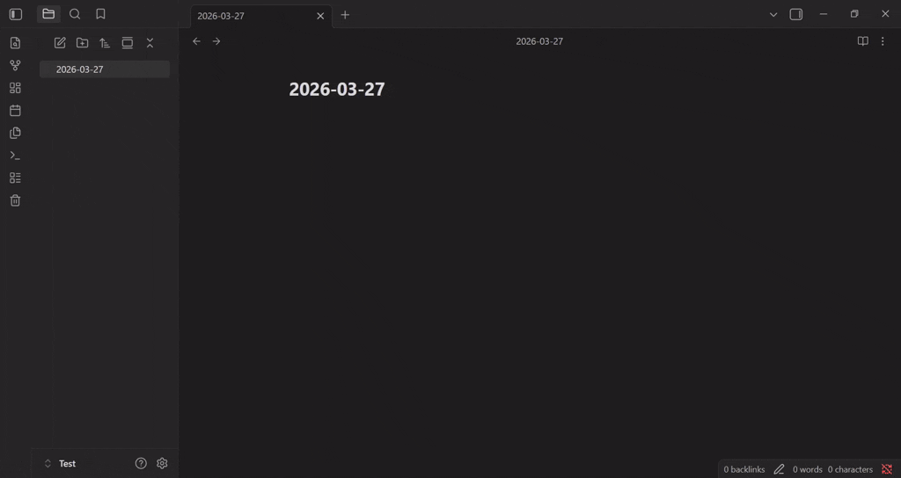
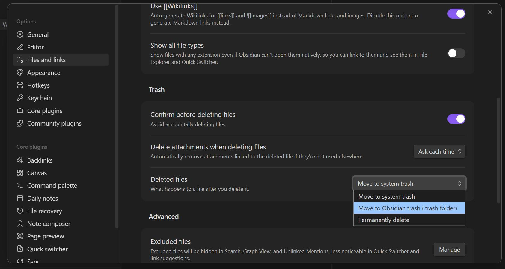

# Obsidian Trash Manager

This is a plugin that allows you to view files in the local .trash, restore them, and permanently delete them.

## Usage

This plugin will add a trash icon to the ribbon. Click on it to open the manager.

[Screenshot](docs/screenshot.jpg)

## Installation

1. Download `manifest.json`, `main.js`, and `styles.css` from the release page 
2. Place them in the following folder inside your vault: `.obsidian/plugins/obsidian-trash-man/`.
3. Open Obsidian settings, go to the Community Plugins section and enable `Trash Man`.

Note: *This plugin only works when the local trash option is activated in Obsidian (Settings -> Files and Links -> Trash -> Choose .trash folder).*

## Development

Clone the repository then run `npm i` to install dependencies. To build, run `npm run build`.
